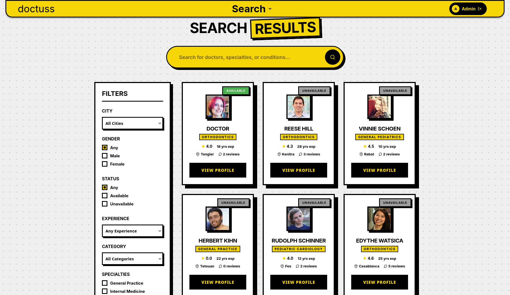
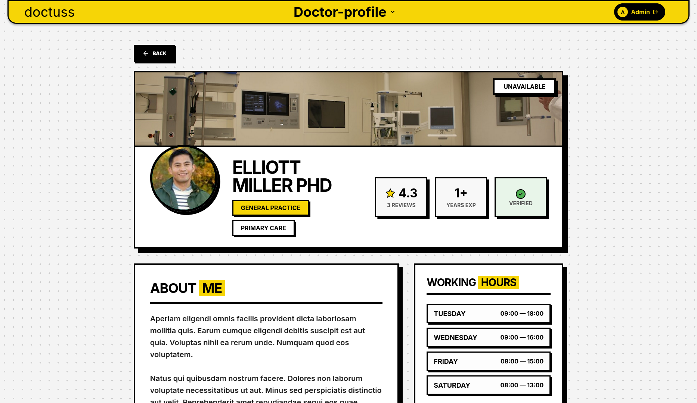
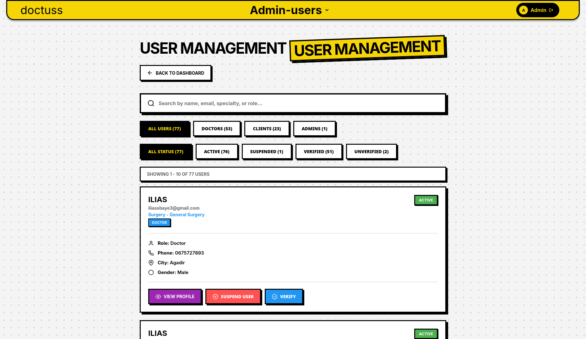

# Doctuss

Doctuss is a full-stack healthcare appointment platform built to connect patients, doctors, and administrators in a single workflow. The project combines a Laravel API with a Vue.js frontend to support doctor discovery, appointment scheduling, profile management, moderation, and verification operations.

This repository is organized as a multi-part workspace:

- `backend/` contains the Laravel 13 API and business logic
- `frontend/` contains the Vue 3 client application
- `document/` contains project documentation and specifications
- `preview/` contains diagrams and interface screenshots

## Screenshots And Diagrams

### UML Diagram


### Use Case Diagram


### Search Doctors



### Doctor Profile



### Admin User Management



## Product Overview

Doctuss is designed around three primary user roles:

- Patients can discover doctors, review profiles, book appointments, and leave feedback
- Doctors can manage their professional profile, define availability, and respond to appointment requests
- Administrators can moderate users, review doctor verification requests, and manage platform quality

## Core Capabilities

### Patient Experience

- Search doctors by name, specialty, category, and city
- Browse public doctor profiles
- Create and track appointments
- Submit doctor reviews after care interactions

### Doctor Workspace

- Maintain a professional profile
- Configure schedules and working dates
- Review incoming appointments
- Submit verification requests and supporting documents

### Administration

- Manage user account status
- Verify and unverify doctor profiles
- Review submitted verification requests
- Moderate reviews and platform activity

## Architecture

### Backend

- Laravel 13
- PHP 8.3
- Laravel Sanctum for authentication
- Pest for testing

The API surface includes authentication, doctor discovery, doctor profile management, appointments, schedules, reviews, verification requests, and admin moderation routes.

### Frontend

- Vue 3
- Vite
- Vue Router
- Vue I18n
- Axios

The client includes dedicated views for authentication, doctor workflows, admin workflows, and core patient-facing screens.

## Repository Structure

```text
.
├── backend/    Laravel API, models, controllers, routes, tests
├── frontend/   Vue application, views, router, localized UI
├── document/   Project specification assets
└── preview/    UML, use case diagrams, and UI screenshots
```

## Getting Started

### Prerequisites

Make sure the following tools are installed:

- PHP 8.3 or newer
- Composer
- Node.js 20 or newer
- npm
- MySQL or SQLite

### Backend Setup

```bash
cd backend
composer install
cp .env.example .env
php artisan key:generate
php artisan migrate --seed
php artisan serve
```

The API will usually be available at `http://127.0.0.1:8000`.

### Frontend Setup

Open a second terminal:

```bash
cd frontend
npm install
npm run dev
```

The frontend development server will usually be available at `http://127.0.0.1:5173`.

## Development Notes

- Backend API routes are defined in `backend/routes/api.php`
- Laravel business logic lives under `backend/app/`
- Frontend views and UI modules live under `frontend/src/`
- The backend also includes a local Vite setup for Laravel-managed assets in `backend/package.json`

## Available Scripts

### Backend

- `composer test` runs the Laravel test suite
- `composer dev` starts the Laravel development workflow

### Frontend

- `npm run dev` starts the Vite development server
- `npm run build` creates a production build
- `npm run preview` previews the production build locally

## Documentation

- [Project Specifications](document/Cahier%20de%20Charge%20-%20Projet%20Doctuss.pdf)

## License

This project is released under the MIT License.
